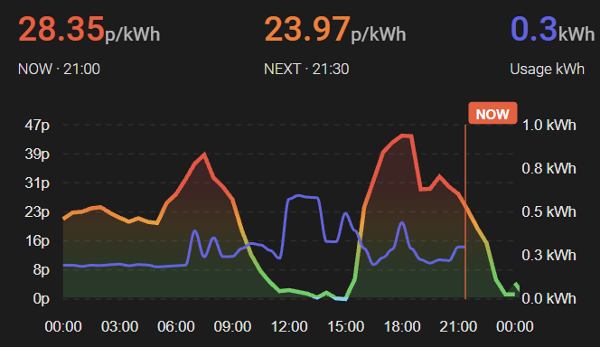

# Octopus Agile Price Graph for Home Assistant

A compact, theme-aware Home Assistant price graph for **Octopus Agile**, built with ApexCharts.

It shows the current and next electricity price, a rolling 24-hour price graph, negative/cheap/expensive price colouring, and support for **Octoplus Power Down and Power Up sessions**.

Power Down periods are automatically shown as purple bands on the graph, and Power Up periods as yellow bands, with additional highlighting when the current or next tariff slot falls inside a joined session.



---

## Features

- 24-hour Octopus Agile electricity price graph
- Current tariff price
- Next tariff price
- Current and next half-hour timestamps
- Live `NOW` marker
- Automatic light/dark theme support
- Dynamic price colouring
- Negative-price highlighting
- Octoplus Power Down session bands
- Octoplus Power Up session bands
- Legacy Saving Sessions and Free Electricity Session support
- Automatic `NOW · POWER DOWN` status
- Automatic `NEXT · POWER DOWN` status
- Automatic `NOW · POWER UP` status
- Automatic `NEXT · POWER UP` status
- Purple current/next prices when the relevant slot is inside Power Down
- Yellow current/next prices when the relevant slot is inside Power Up
- Compact two-column header
- Continuous graph across current-day and next-day Agile data
- Optional secondary-axis line showing today's cumulative electricity usage, with a live running total in the header

---

## Requirements

This card uses the following Home Assistant custom cards:

- [ApexCharts Card](https://github.com/RomRider/apexcharts-card)
- [Config Template Card](https://github.com/iantrich/config-template-card)
- [card-mod](https://github.com/thomasloven/lovelace-card-mod)

Installing them through **HACS** is recommended.

You will also need the [Octopus Energy integration](https://github.com/BottlecapDave/HomeAssistant-OctopusEnergy) configured in Home Assistant with entities for:

- Current electricity rate
- Next electricity rate
- Current-day rates
- Next-day rates
- Octoplus Power Down calendar
- Octoplus Power Up calendar

The Power Down and Power Up calendar entities must each expose `start_time` and `end_time` attributes for the current or next joined session, along with an `on`/`off` state indicating whether a session is currently active.

If your account (or integration version) still uses the older naming, the card will also work with:

- Octoplus Saving Sessions calendar (legacy equivalent of Power Down)
- Octoplus Free Electricity Session calendar (legacy equivalent of Power Up)

You only need to configure whichever pair of entities actually exists on your system — see [Entity configuration](#entity-configuration) below.

---

## Installation

### 1. Install the required custom cards

Install the following through HACS:

1. ApexCharts Card
2. Config Template Card
3. card-mod

Restart Home Assistant or reload the frontend if required.

---

### 2. Download the YAML

Copy:

```text
octopus_agile_power_down_graph.yaml
```

into a manual Lovelace card.

You can either paste the full YAML directly into the dashboard editor or store it wherever you normally keep reusable Lovelace configuration.

---

### 3. Find your Octopus entities

In Home Assistant, go to:

```text
Developer Tools → States
```

Find the entities corresponding to:

```text
Current electricity rate
Next electricity rate
Current-day rates
Next-day rates
Octoplus Power Down
Octoplus Power Up
Octoplus Saving Sessions (legacy - only if Power Down doesn't exist)
Octoplus Free Electricity Session (legacy - only if Power Up doesn't exist)
Current-day accumulative consumption (optional - only if you want the usage line)
```

The exact entity IDs vary between installations.

---

## Entity configuration

The shared YAML contains placeholder entity IDs.

Search for and replace each of these with the matching entity from your own Home Assistant installation.

### Current rate

```text
sensor.octopus_energy_electricity_your_mpan_your_meter_serial_current_rate
```

Replace with your current-rate sensor.

---

### Next rate

```text
sensor.octopus_energy_electricity_your_mpan_your_meter_serial_next_rate
```

Replace with your next-rate sensor.

---

### Current-day rates

```text
event.octopus_energy_electricity_your_mpan_your_meter_serial_current_day_rates
```

Replace with your current-day rates event entity.

---

### Next-day rates

```text
event.octopus_energy_electricity_your_mpan_your_meter_serial_next_day_rates
```

Replace with your next-day rates event entity.

---

### Octoplus Power Down

```text
calendar.octopus_energy_your_account_id_octoplus_power_down
```

Replace with your Octoplus Power Down calendar entity.

---

### Octoplus Power Up

```text
calendar.octopus_energy_your_account_id_octoplus_power_up
```

Replace with your Octoplus Power Up calendar entity.

---

### Octoplus Saving Sessions (legacy)

```text
calendar.octopus_energy_your_account_id_octoplus_saving_sessions
```

Only used automatically as a fallback if the Power Down calendar entity above doesn't exist. If you have a Power Down entity, you can leave this placeholder as-is.

---

### Octoplus Free Electricity Session (legacy)

```text
calendar.octopus_energy_your_account_id_octoplus_free_electricity_session
```

Only used automatically as a fallback if the Power Up calendar entity above doesn't exist. If you have a Power Up entity, you can leave this placeholder as-is.

---

### Today's electricity usage (optional)

```text
sensor.octopus_energy_electricity_your_mpan_your_meter_serial_current_accumulative_consumption
```

Replace with your accumulative consumption sensor. This powers the optional "Usage kWh" line drawn on a secondary axis (see [usage line](#usage-line) below). If you don't want this line, you can remove that series from the YAML entirely.

---

## Example entity mapping

Your entities may look broadly like:

```yaml
sensor.octopus_energy_electricity_xxx_xxx_current_rate
sensor.octopus_energy_electricity_xxx_xxx_next_rate
event.octopus_energy_electricity_xxx_xxx_current_day_rates
event.octopus_energy_electricity_xxx_xxx_next_day_rates
calendar.octopus_energy_xxx_octoplus_power_down
calendar.octopus_energy_xxx_octoplus_power_up
calendar.octopus_energy_xxx_octoplus_saving_sessions
calendar.octopus_energy_xxx_octoplus_free_electricity_session
sensor.octopus_energy_electricity_xxx_xxx_current_accumulative_consumption
```

Do **not** copy these examples literally. Use the entities from your own Home Assistant installation.

---

# Price colours

The graph uses an Apple-inspired colour palette with separate light and dark theme colours.

The default price scale is:

| Price | Colour |
|---|---|
| Negative | Cyan → Blue |
| 0–5p/kWh | Green |
| 5–20p/kWh | Green → Orange |
| 20–30p/kWh | Orange → Red |
| 30p+/kWh | Red |

The colour transition is gradual rather than using only fixed colour bands.

---

## Negative prices

Negative Agile prices use a cyan-to-blue scale.

Prices close to zero appear cyan, gradually moving toward blue as the price approaches approximately:

```text
-7p/kWh
```

This makes negative periods visually distinct from normal cheap electricity.

---

# Current and next prices

The header displays two values.

Example:

```text
NOW · 17:30                 NEXT · 18:00
56.34 p/kWh                 58.65 p/kWh
```

The displayed times represent the **start time of each half-hour Agile tariff slot**.

---

## Free / negative electricity

If the current price is zero or negative, the current header changes to:

```text
NOW · 17:30 · FREE
```

The price colour continues to follow the negative-price cyan/blue scale.

---

# Octoplus Power Down support

Joined Octoplus Power Down sessions are automatically detected using the:

```text
start_time
end_time
```

attributes exposed by the Power Down calendar entity, along with its `on`/`off` state.

Home Assistant calendar entities only ever expose the **current or next** event, so the graph shows at most one upcoming (or active) session at a time — the same behaviour as before.

A joined session is displayed as:

- A translucent purple vertical band
- A purple start boundary
- A purple end boundary
- A `POWER DOWN` label above the graph

Example:

```text
                  POWER DOWN
                      ↓
                 │░░░░░░░│
                 │░░░░░░░│
─────────────────│░░░░░░░│────────────
                 │░░░░░░░│
                 │░░░░░░░│
               18:00    19:00
```

---

## Before a Power Down session

If the next half-hour falls inside a joined Power Down session, the next price becomes purple and the header changes to:

```text
NEXT · 18:00 · POWER DOWN
```

For example:

```text
NOW · 17:30             NEXT · 18:00 · POWER DOWN
56.34                   58.65
```

The current price remains in its normal tariff colour because the session has not started yet.

---

## During a Power Down session

When the current time falls inside a joined session:

```text
NOW · 18:00 · POWER DOWN
```

The current price also becomes purple.

If the next half-hour is still inside the same session, both current and next values are purple:

```text
NOW · 18:00 · POWER DOWN     NEXT · 18:30 · POWER DOWN
58.65                        42.13
```

---

## Approaching the end of Power Down

If the current half-hour is inside Power Down but the next half-hour begins outside it:

```text
NOW · 18:30 · POWER DOWN     NEXT · 19:00
42.13                        24.18
```

Only the current value remains purple.

This makes the Power Down state specific to the actual tariff slot rather than simply colouring both values for the entire event.

---

# Octoplus Power Up support

Octoplus Power Up sessions (where you're rewarded for using **more** electricity, rather than less) are detected in exactly the same way as Power Down, using the:

```text
start_time
end_time
```

attributes exposed by the Power Up calendar entity, along with its `on`/`off` state.

A joined session is displayed as:

- A translucent yellow vertical band
- A yellow start boundary
- A yellow end boundary
- A `POWER UP` label above the graph

Example:

```text
                   POWER UP
                      ↓
                 │▒▒▒▒▒▒▒│
                 │▒▒▒▒▒▒▒│
─────────────────│▒▒▒▒▒▒▒│────────────
                 │▒▒▒▒▒▒▒│
                 │▒▒▒▒▒▒▒│
               13:00    14:00
```

The header behaves the same way as it does for Power Down:

```text
NEXT · 13:00 · POWER UP        (before the session starts)
NOW · 13:00 · POWER UP         (during the session)
```

with the current/next price turning yellow instead of purple, and only the slot actually inside the session being highlighted.

Power Down and Power Up are mutually exclusive by nature (you can't be asked to use both less and more electricity in the same slot), so only one of these states will ever be shown at a time.

---

# Legacy Saving Sessions and Free Electricity Session support

Some accounts, and older versions of the Octopus Energy integration, expose these events under different, older entity names:

| Current name | Legacy name |
|---|---|
| Octoplus Power Down | Octoplus Saving Sessions |
| Octoplus Power Up | Octoplus Free Electricity Session |

The card checks for the current-style entity first. If it doesn't exist in your Home Assistant installation, the card automatically falls back to the corresponding legacy entity instead — so you only need to fill in whichever pair actually exists for your account.

---

# Power Down and Power Up colours

Power Down uses a dedicated purple colour:

### Dark mode

```text
#BF5AF2
```

### Light mode

```text
#AF52DE
```

Power Up uses a dedicated yellow colour:

### Dark mode

```text
#FFD60A
```

### Light mode

```text
#FFCC00
```

Both are intentionally separate from the electricity price scale.

This means:

```text
Blue / Cyan / Green / Orange / Red = electricity price
Purple                                = Octoplus Power Down
Yellow                                = Octoplus Power Up
```

---

## Power Down and Power Up shading

The default band opacity for both is:

```yaml
Dark mode:  0.14
Light mode: 0.09
```

You can change these independently under:

```yaml
POWER_DOWN_OPACITY:
POWER_UP_OPACITY:
```

---

# Power Down and Power Up label position

Both labels are raised above the graph so they do not overlap the `NOW` marker.

The default setting for each, found in its own annotation block in the YAML, is:

```yaml
offsetY: -26
```

To move a label higher:

```yaml
offsetY: -32
```

To move a label lower:

```yaml
offsetY: -18
```

You can also adjust the horizontal position using:

```yaml
offsetX: 10
```

Positive values move it right and negative values move it left. Adjust the Power Down and Power Up annotation blocks independently if you need them positioned differently.

---

# NOW marker

The vertical `NOW` marker always retains the colour of the underlying electricity price.

This is intentional.

During Power Down or Power Up:

- Header colour = Power Down/Power Up status
- Purple or yellow graph band = Power Down/Power Up period
- NOW line colour = actual electricity price

This allows both pieces of information to remain visible at the same time.

---

# Theme compatibility

The card automatically detects Home Assistant dark mode using:

```javascript
this.hass.themes.darkMode
```

Separate colours are used for:

- Blue
- Cyan
- Green
- Orange
- Red
- Purple
- Yellow

The rest of the card uses Home Assistant theme variables where possible.

No specific dashboard theme is required.

---

# Graph window

The card displays:

```yaml
graph_span: 24h

span:
  start: day
```

This means the graph begins at midnight (the start of the current day) and shows the following 24 hours.

Current-day and next-day Octopus rates are merged to keep the graph continuous across midnight.

If you'd prefer the window to instead begin at the start of the current hour (so it's always centred more closely on "now"), change `start: day` to `start: hour`.  This will limit the visibility of the optional accumulative usage if the day's displayed history is set to the start of the current hour.

---

# Refresh interval

The card uses:

```yaml
update_interval: 1min
```

This keeps:

- The NOW marker
- Current/next slot status
- Power Down state

reasonably current.

There may therefore be a short delay of up to approximately one minute around tariff or Power Down boundaries.

---

# Usage line

If you configure the optional accumulative consumption sensor, the card draws an indigo line showing your running electricity usage for the day (in kWh) on a **secondary y-axis**, independent of the price scale on the left.

```yaml
yaxis:
  - id: price
    ...

  - id: consumption
    opposite: true
    decimals: 1
    min: 0
    max: ${CONSUMPTION_MAX}
```

The `consumption` axis is plotted on the right-hand side of the graph (`opposite: true`) so it doesn't interfere with the price axis on the left. `max` is a fixed number by the time apexcharts-card sees it, but that number is computed dynamically each render from a `CONSUMPTION_MAX` variable, defined earlier in the YAML:

```yaml
CONSUMPTION_MAX: |
  (() => {
    const entity =
      states['sensor.octopus_energy_electricity_your_mpan_your_meter_serial_current_accumulative_consumption'];

    const charges =
      Array.isArray(entity?.attributes?.charges)
        ? entity.attributes.charges
        : [];

    const values =
      charges
        .map((entry) => Number(entry.consumption))
        .filter((value) =>
          Number.isFinite(value)
        );

    const peak = values.length ? Math.max(...values) : 0;

    const AXIS_FLOOR_KWH = 1;
    const HEADROOM_MULTIPLIER = 1.2;

    return Math.max(AXIS_FLOOR_KWH, peak * HEADROOM_MULTIPLIER);
  })()
```

This finds today's single largest half-hourly reading and sets the axis to 20% above it — so a quiet day (peak 0.4 kWh) zooms the axis in to `AXIS_FLOOR_KWH` (1 kWh) for readable detail, while a day with a 7 kWh spike (an oven, shower, or EV charging session) automatically widens the axis to around 8.4 kWh so the line isn't clipped.

Why not just use apexcharts-card's own auto/soft-bound scaling (`max: auto` or `max: ~2`) for this instead of a hand-rolled variable? Because there's an odd behaviour in apexcharts: a second y-axis using auto or soft bounds on a chart that also has header-only (`in_chart: false`) series — which this card does, for the current/next price headers — can end up borrowing the range computed for the *first* axis instead of its own data. By computing the peak ourselves and substituting in a literal number via `${CONSUMPTION_MAX}`, apexcharts-card only ever sees a plain fixed value and never goes rogue, while the axis still adapts day-to-day.

The line itself is drawn by its own series, further down the YAML:

```yaml
- entity: sensor.octopus_energy_electricity_your_mpan_your_meter_serial_current_accumulative_consumption
  name: Today Usage kWh
  type: line
  float_precision: 1
  yaxis_id: consumption
  stroke_width: 2
  color: (indigo, theme-aware)
  extend_to: now
  show:
    in_header: before_now
    in_legend: false
    legend_value: false
    datalabels: false
  data_generator: |
    const charges =
      Array.isArray(entity.attributes.charges)
        ? entity.attributes.charges
        : [];

    const consumptionByTime = new Map();

    charges.forEach((entry) => {
      const time = new Date(entry.start).getTime();
      const value = Number(entry.consumption);

      if (
        Number.isFinite(time) && Number.isFinite(value)
      ) {
        consumptionByTime.set(time, value);
      }
    });

    const slotLength = 30 * 60 * 1000;
    const dayStart = new Date();
    dayStart.setHours(0, 0, 0, 0);
    const dayStartTime = dayStart.getTime();

    const points = [];
    for (let i = 0; i < 48; i++) {
      const time = dayStartTime + (i * slotLength);
      points.push([
        time,
        consumptionByTime.has(time) ? consumptionByTime.get(time) : null
      ]);
    }

    return points;
```

It reads the sensor's `charges` attribute (an array of half-hourly `{ start, consumption }` entries) and builds a full 48-slot scaffold covering today, one point every 30 minutes from midnight, using `null` for any slot without a reading yet (typically everything from "now" onwards). `extend_to: now` then draws the visible line from the last real reading up to the current time, exactly as you'd expect.

`show.in_header: before_now` shows the running usage total in the card's header (the third value, alongside NOW/NEXT price), using the most recent *real* reading rather than literally the array's last entry. This distinction matters specifically because the data spans into the future (the null-padded slots described above) — plain `in_header: true` would pick up one of those `null` future slots and display "N/A" once the graph rolls past the last real reading. `before_now` (a value apexcharts-card provides for exactly this situation) always resolves to the value at or just before the current time instead. If you'd rather not show this value in the header at all, set it back to `in_header: false`.

Building a full 48-slot scaffold — rather than just returning however many readings exist so far — matters for a reason that has nothing to do with the line's own appearance: it keeps this series' timestamps aligned, index for index, with the price series below it. ApexCharts' tooltip matches values across series by array position, and requires every series on the chart to share the same x-values to do that reliably; a shorter, irregular series here previously broke the tooltip when hovering near it (see [Hovering over the usage line shows an empty or broken tooltip](#hovering-over-the-usage-line-shows-an-empty-or-broken-tooltip) below).

If you don't want this line at all, delete this series block from the YAML, and remove the second `yaxis` entry (`id: consumption`) as well — with only one y-axis left, you can also drop the `yaxis_id: price` lines from the remaining series, since a single y-axis no longer needs to be referenced explicitly.

To customise it further:

- **Line colour** — change the `color:` field on this series to any fixed colour, or point it at a different theme variable.
- **Line thickness** — adjust `stroke_width` (default `2`).
- **Axis scale** — adjust `AXIS_FLOOR_KWH` and `HEADROOM_MULTIPLIER` in the `CONSUMPTION_MAX` variable to change how tightly the axis zooms on quiet days and how much headroom is left above a peak. `MAX_PLAUSIBLE_KWH` appears in *both* `CONSUMPTION_MAX` and the series' own `data_generator` — keep the two in sync if you change one, since they're independent copies.
- **Axis position** — set `opposite: false` on the `consumption` yaxis entry to draw it on the left instead of the right (it will overlap the price axis's tick labels, so this isn't recommended unless you also hide one of them).
- **Tooltip** — the usage line's own value is left out of the tooltip by default; see [Hovering over the usage line shows an empty or broken tooltip](#hovering-over-the-usage-line-shows-an-empty-or-broken-tooltip) below for how to switch that on or off.

---

# Customisation

## Change graph height

Find:

```yaml
chart:
  height: 190px
```

For a taller graph:

```yaml
height: 230px
```

For a more compact graph:

```yaml
height: 160px
```

---

## Change line thickness

Find:

```yaml
stroke_width: 3
```

and adjust as required.

For example:

```yaml
stroke_width: 2
```

---

## Change the cheap-price threshold

The default card keeps prices below:

```text
5p/kWh
```

green.

Look for:

```javascript
if (price < 5)
```

and the corresponding:

```yaml
- value: 5
```

entries in the colour thresholds.

Make sure to update both the header colour logic and graph thresholds if you change the scale.

---

## Change the expensive-price threshold

The graph reaches full red at:

```text
30p/kWh
```

Look for:

```javascript
if (price < 30)
```

and:

```yaml
- value: 30
```

---

# Troubleshooting

## Card does not appear

Check that all required custom cards are installed:

```text
apexcharts-card
config-template-card
card-mod
```

Then refresh the browser/app.

A hard browser refresh may sometimes be necessary after installing frontend resources.

---

## Entity not found

Verify every placeholder has been replaced with your own entity ID.

Search the YAML for:

```text
your_mpan
your_meter_serial
your_account_id
```

None of these placeholders should remain after configuration.

Also confirm that `calendar.octopus_energy_your_account_id_octoplus_power_down` and `calendar.octopus_energy_your_account_id_octoplus_power_up` match entities that actually exist in your installation — some Octopus Energy integration versions only expose the older `event.octopus_energy_..._octoplus_power_down_events` entity, or the legacy `calendar.octopus_energy_..._octoplus_saving_sessions` / `calendar.octopus_energy_..._octoplus_free_electricity_session` calendars, in which case you'll need to either update your integration or fill in the legacy placeholders instead (see [Entity configuration](#entity-configuration)).

---

## Price graph is empty

Check the attributes of your current-day and next-day rate event entities.

They should expose rate data containing values similar to:

```yaml
rates:
  - start: ...
    end: ...
    value_inc_vat: ...
```

The card expects:

```text
rates
start
end
value_inc_vat
```

---

## Power Down or Power Up band does not appear

Check the relevant calendar entity in:

```text
Developer Tools → States
```

and inspect its attributes.

The card expects:

```yaml
start_time:
end_time:
```

If neither attribute is present, the calendar entity currently has no current or upcoming joined session to report.

The card only displays a session if it overlaps the visible 24-hour graph period.

If you're using the legacy Saving Sessions or Free Electricity Session calendars, the card only falls back to them automatically when the current-style entity (Power Down or Power Up) doesn't exist at all — if both entities exist but the wrong one is populated, check you've entered the correct entity ID for your account.

---

## Power Down or Power Up is listed by Octopus but not shown

Make sure you have actually **joined** the session.

The calendar entity only ever reflects **joined** sessions, so an available-but-unjoined session from Octopus will not appear on the graph.

---

## POWER DOWN or POWER UP label overlaps NOW

Adjust the `offsetY` value in that band's annotation block:

```yaml
offsetY: -26
```

For example:

```yaml
offsetY: -32
```

---

## NEXT does not turn purple or yellow

The card calculates the next Agile half-hour directly from the current time.

For example:

```text
17:35 → 18:00
18:05 → 18:30
18:35 → 19:00
```

The next value only turns purple or yellow when that upcoming half-hour overlaps a joined Power Down or Power Up session, respectively.

---

## Usage axis (right-hand side) is scaled far higher than my actual usage

This is caused by a known apexcharts-card limitation, not bad sensor data: with more than one y-axis on a chart, a second axis using soft (`~N`) or auto scaling can end up borrowing the scale computed for the *first* axis instead of its own data — particularly on charts (like this one) that also include header-only (`in_chart: false`) series. The symptom is a right-hand axis that reaches a suspiciously round-looking maximum close to the price axis's own top value, even though the actual usage line stays low.

The fix is already applied in the YAML: the `consumption` yaxis's `max` is `${CONSUMPTION_MAX}`, a plain computed number by the time apexcharts-card sees it — not a soft (`~N`) or `auto` bound — which sidesteps the buggy calculation entirely. If you still see this after applying an update, or after changing `max: ${CONSUMPTION_MAX}` back to something like `max: ~2` or `max: auto`:

- Double-check the `consumption` yaxis entry's `max` still resolves to a plain fixed number, not a `~`-prefixed soft bound or `auto`.
- If your usage line is being clipped at the top instead (flat-lining at the axis maximum), that suggests `CONSUMPTION_MAX` is computing lower than your actual peak — raise `HEADROOM_MULTIPLIER` in that variable.

---

## Usage line's header value shows "N/A"

This happens if `show.in_header` on the usage series is set to plain `true` instead of `before_now`. Because that series' data spans into the future (see [Usage line](#usage-line) above), a plain `true` picks up literally the last entry in the data array for the header value — which, once the graph rolls past your last real reading, is one of the `null` future slots, hence "N/A". Set it to `in_header: before_now` instead, which apexcharts-card resolves to the most recent real reading rather than the last array entry.

---

## Hovering over the usage line shows an empty or broken tooltip

This is a documented ApexCharts limitation: the default "shared" tooltip mode matches values across series by array position, and explicitly requires every series on the chart to share the same set of x-values to work reliably. Originally, the usage line only returned however many readings existed so far today — a shorter, irregular set of points compared to the price series, which always spans the full graph window — and hovering near a point that only existed on the usage line broke the shared lookup for the whole tooltip.

The fix: the usage series' `data_generator` (see [Usage line](#usage-line) above) now always returns a full 48-slot scaffold for today, one point every 30 minutes from midnight, with `null` for any slot that doesn't have a reading yet. This lines its timestamps up exactly, index for index, with the price series, so the tooltip's shared lookup has no mismatch to trip over — hovering anywhere on the graph now works the same forgiving way it always did for price alone.

```yaml
tooltip:
  enabledOnSeries:
    - 0 # Price area
    - 1 # Current-day price line
    - 2 # Next-day price line
    - 3 # Today Usage kWh - uncomment to include in the tooltip
```

If you'd rather disable tooltips altogether, set `tooltip.enabled: false` on the chart's `apex_config` instead.

If you still see a broken tooltip after all this, it likely means either the accumulative consumption sensor isn't reporting in the expected `{ start, consumption }` shape, or a card update elsewhere in the config changed the series order (the `enabledOnSeries` indices above assume the five price/consumption series are still in their original order) — check the browser console for ApexCharts warnings, and confirm the series order in the YAML matches the comments above.

---

# Contributing

Suggestions, fixes and improvements are welcome.

If you encounter an issue, please include:

- Home Assistant version
- ApexCharts Card version
- Config Template Card version
- Octopus Energy integration version
- Relevant entity attributes

Please remove any personal information before posting entity IDs, logs, screenshots or attributes.

---

# Issues

When opening an issue, please describe:

1. What you expected to happen
2. What actually happened
3. Whether normal Agile prices are working
4. Whether the Power Down/Power Up calendar entity has `start_time`/`end_time` attributes set
5. Any relevant errors from the browser console or Home Assistant

Please redact your MPAN, meter serial number, account identifiers and any unrelated personal information.

---

# Disclaimer

This is a community Home Assistant configuration.

It is not affiliated with, endorsed by, or maintained by Octopus Energy.

Entity names, attributes and integration behaviour may change between versions of Home Assistant or the Octopus Energy integration.

Always verify electricity pricing and event information using the official Octopus Energy services when accuracy is important.

---

# Licence

This project is available under the MIT Licence.

See:

```text
LICENSE
```

for details.

---

# Credits

Built using:

- Home Assistant
- Octopus Energy integration
- ApexCharts Card
- Config Template Card
- card-mod

If you improve the card or adapt it for another Octopus tariff, contributions are welcome.